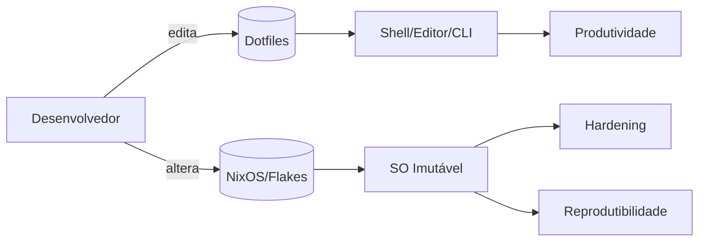

## 🛠️ Lab & Infrastructure

  
  

* **Hardware:** ASUS ROG Flow Z13
* **Environment:** Multi-monitor array (6 screens) for high-density monitoring.
* **Operating Systems:** Linux Specialist (Bazzite, NixOS, Arch, RHEL, Debian).
* **Core Focus:** Senior Full Stack Development & Infrastructure Engineering.

## Laboratório de Infraestrutura Imutável

Este repositório documenta um ambiente de desenvolvimento imutável,
reproduzível e seguro, baseado em Windows 11 Pro (WSL2 com Ubuntu/Debian)
e foco em containers (Docker/Compose). O objetivo é demonstrar automação do
sistema, hardening e um fluxo de trabalho profissional.

## Objetivos

- Tornar o setup totalmente reprodutível
- Versionar configurações críticas do ambiente
- Garantir segurança por padrão
- Documentar decisões e arquitetura

## Diagrama de Arquitetura

## Estrutura do Repositório

- `docs/` documentação e diagramas
- `dotfiles/` configurações do usuário (shell, editor, tools)
- `nixos/` módulos e flakes do NixOS
- `.github/workflows/` automações de CI
- `scripts/` scripts utilitários
- `docker-compose.yml` compose base para serviços

## Instalação (Visão Geral)

1. Copie ou sincronize as configurações desejadas.
2. Aplique os dotfiles no seu home.
3. Para NixOS, aplique o flake/módulos conforme sua máquina.

Detalhes completos em `docs/INSTALLATION.md` e `docs/WSL2-SETUP.md`.

## Uso

- Ajuste variáveis específicas da sua máquina (host, usuário, paths).
- Mantenha alterações pequenas e rastreáveis.
- Use commits convencionais.

## Hardening (Resumo)

- Privilégio mínimo
- Firewall e serviços essenciais
- Atualizações controladas
- Auditoria de mudanças

## Reprodutibilidade

- Configuração declarativa
- Versionamento de dependências
- Ambiente determinístico

## CI

O pipeline valida Markdown para garantir documentação consistente a cada
commit.

## Conventional Commits

Exemplos:

- `feat: adicionar configuração do shell`
- `docs: documentar hardening de rede`
- `chore: organizar estrutura do repo`

## Próximos Passos

- Adicionar módulos específicos por host
- Incluir scripts de bootstrap
- Documentar restore completo do ambiente

## Documentação Principal

- `docs/WSL2-SETUP.md`
- `docs/CONTAINERS.md`
- `docs/DOCKER.md`
- `docs/STACK.md`
- `docs/HARDWARE.md`
- `docs/architecture.md`
- `docs/PACKAGES.md`
- `docs/SETUP-RAPIDO.md`

