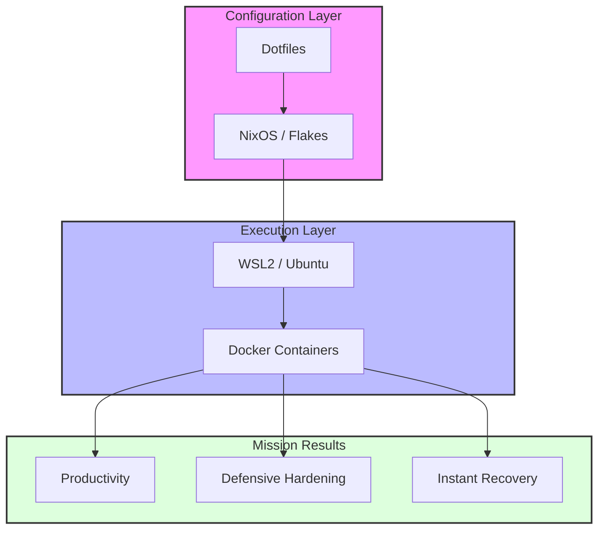

# 🏛️ Immutable Infrastructure Architecture

This document outlines the core architectural principles and the high-level design of the **Immutable Infrastructure Lab**. The ecosystem is engineered for total reproducibility, high performance, and security-first operations.

---

## 🛰️ High-Level Design

The architecture is divided into three distinct layers, ensuring that system configuration is decoupled from the runtime environment.

### 1. Configuration Layer (The Source of Truth)
Everything starts with declarative definitions.
* **NixOS / Flakes:** Defines the entire OS state, packages, and system services in a reproducible way.
* **Dotfiles:** Managed user-space preferences (Zsh, Tmux, Neovim) synchronized across environments.

### 2. Runtime Layer (Execution Engine)
Where the code actually runs, optimized for the **i9-13900H** hybrid architecture.
* **WSL2 Subsystem:** Provides the Linux kernel bridge on Windows 11 Pro.
* **Docker Engine:** Orchestrates the **VILT Stack** (Laravel, Vue.js, Inertia) in isolated containers.

### 3. Output Layer (Mission Objectives)
The final results of the infrastructure's operation.
* **Productivity:** High-density coding across the **6-monitor array**.
* **Hardening:** Security measures derived from **PMESP** mission-critical standards.
* **Reproducibility:** The ability to rebuild the entire lab on a new machine in minutes.

---

## 🛠️ Architectural Decisions (ADRs)

| Decision | Rationale |
| :--- | :--- |
| **Declarative Config** | Eliminates "Configuration Drift" and ensures environment parity. |
| **Layer Separation** | Decouples user preferences from system binaries for easier auditing. |
| **Immutable Core** | Protects the base OS from accidental changes or unauthorized tampering. |

---

## 📊 System Flow Visualization

---

## 🛡️ Security & Resilience by Design
Following the Zero-Trust model, the architecture ensures that every component is ephemeral and replaceable.

Storage Encryption: Hardware-backed AES-256 on the 2TB WD PC SN740 NVMe.

Atomic Updates: NixOS generations allow for instant rollbacks if a system update fails.

Institutional Standards: Implementation of security protocols based on PMESP infrastructure requirements.
