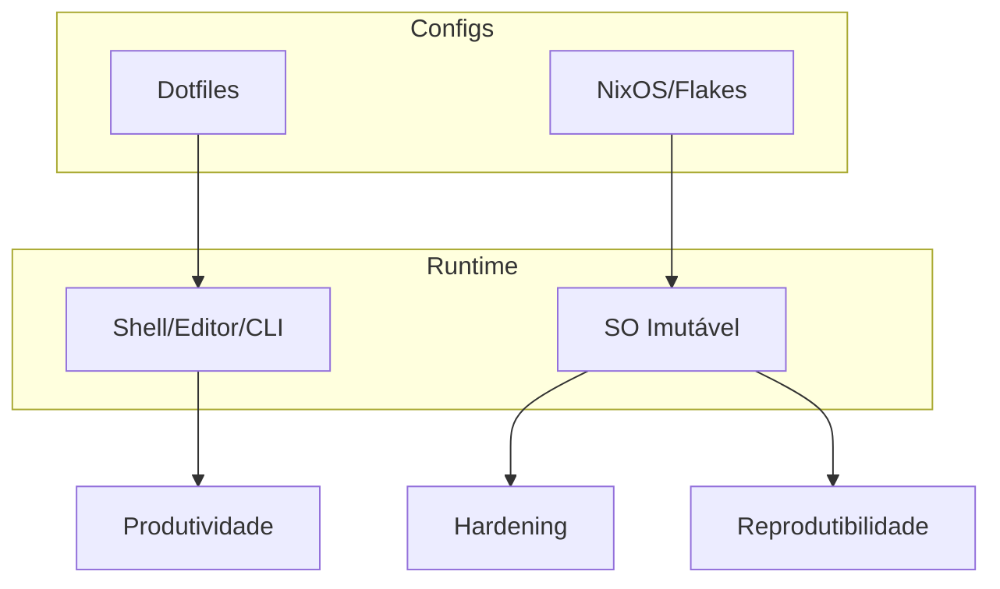

# Arquitetura do Laboratório de Infraestrutura Imutável

Este documento detalha os componentes do ambiente e como eles se conectam.

## Diagrama

## Decisões

- Configuração declarativa para consistência
- Separação entre sistema e preferências do usuário
- Mudanças pequenas e auditáveis
