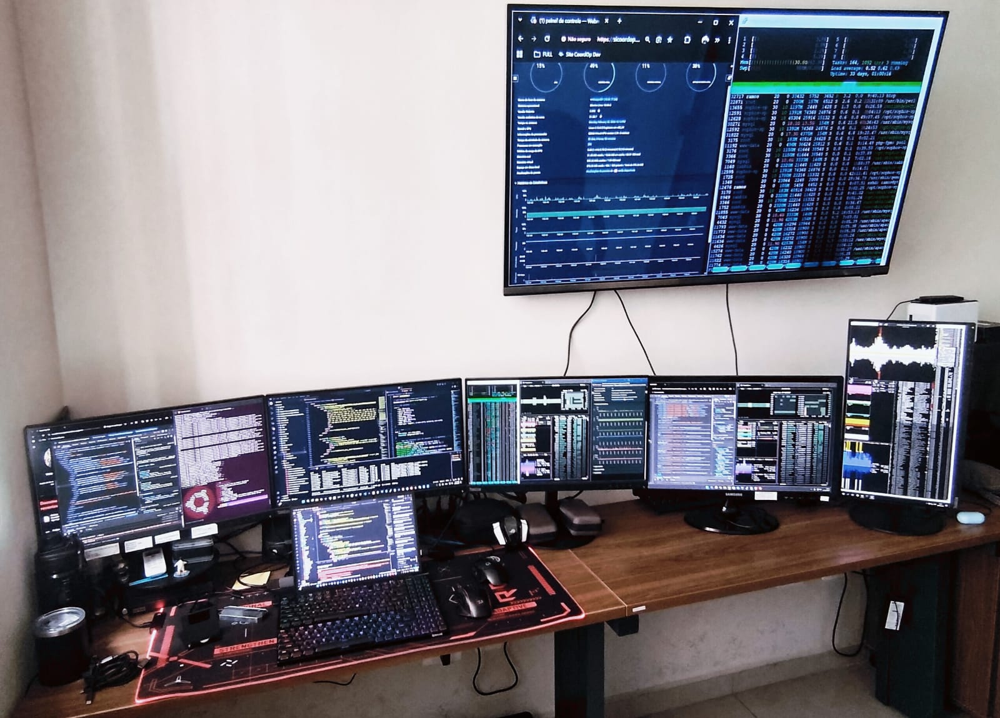

# 📸 System & Infrastructure Evidence

This gallery provides visual confirmation of the laboratory's operational status, performance metrics, and high-density observability environment.

---

## 🚀 System Performance (i9-13900H + WSL2)

* **Kernel & Host Audit**: Visualizing the Ubuntu 24.04.3 LTS environment running on the latest Microsoft WSL2 kernel.
* **Resource Management**: Evidence of the 14-core architecture handling intensive development workloads.

  

---

## 🐳 Container Orchestration (Docker)

* **VILT Stack Runtime**: Confirmation of isolated containers for Laravel, Redis, and MySQL.
* **Efficiency Audit**: Real-time resource consumption stats showing optimized memory footprints.

  

---

## 📺 Observability Environment (6-Monitor Array)

* **Multitasking Workflow**: Real-time view of the terminal multiplexing (Tmux) and system monitoring across the extended workspace.
* **Institutional Hardening**: Verification of secure shell sessions and encrypted storage status.

  
  

